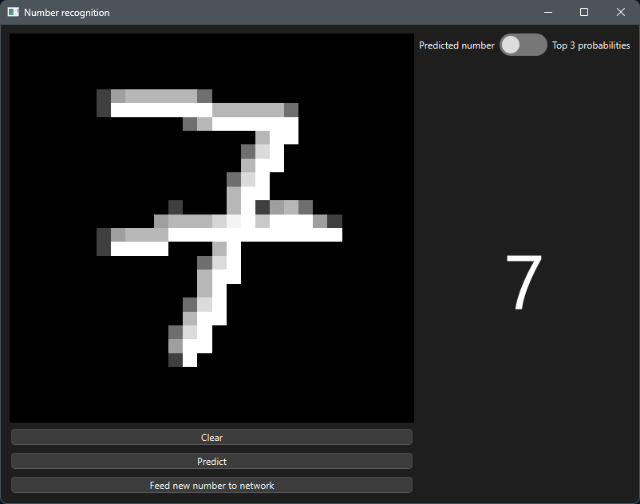
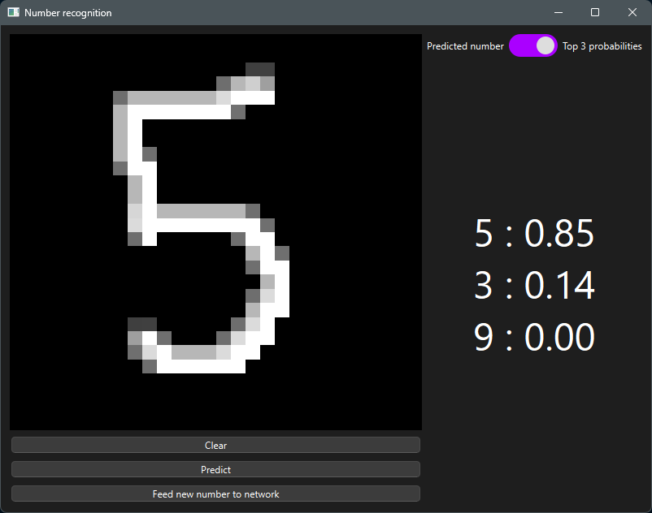
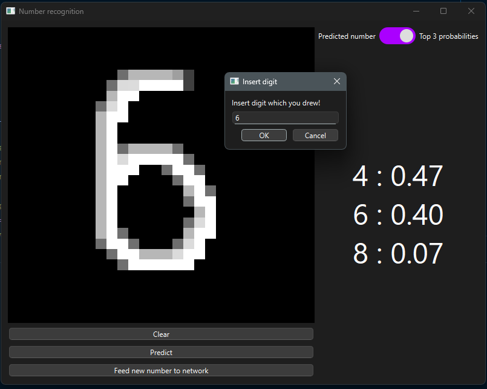
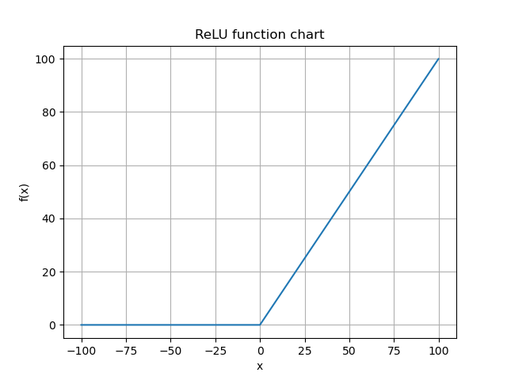
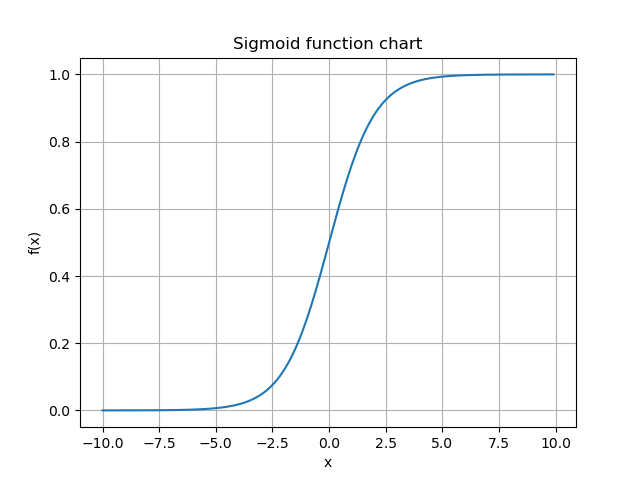
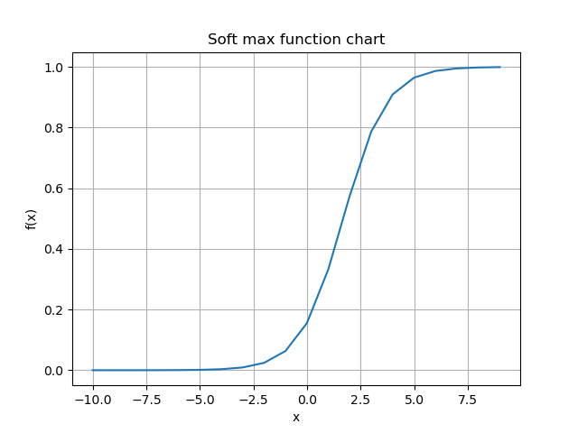

# Drawn Digit Predictor

Handwritten digit recognition project built from scratch in NumPy.  
The model is trained on the MNIST dataset and integrated with a PyQt GUI that lets you draw digits on a canvas and
immediately see the predicted digit.

---

## Table of Contents

- [Description](#description)
- [Demo](#demo)
- [Features](#features)
- [Technologies](#technologies)
- [Usage](#usage)
- [Model and Theory](#model-and-theory)
    - [Sizes](#sizes)
    - [Activations](#activations)
    - [Feed forward](#feed-forward)
    - [Backpropagation](#backpropagation)
- [GUI – How to Use](#gui--how-to-use)
- [License](#license)

---

## Description

The goal of this project is to build a digit classifier (0–9) from scratch, without using deep learning frameworks such
as PyTorch or TensorFlow. The model:

- is trained on the classic MNIST dataset,
- can also classify digits drawn by the user in a GUI window,
- demonstrates how to implement forward pass, backpropagation, softmax, and cross-entropy in pure NumPy.

---

## Demo

Digit prediction based on user drawing.

<p align="center">
  

</p>

Top 3 digit probabilities.

<p align="center">
  
</p>

Correcting network

<p align="center">
  

</p>

---

## Features

- Flexible network architecture: configurable layer sizes, activation functions (sigmoid, ReLU, softmax) and loss
  functions.
- Training on the MNIST dataset.
- Input data normalization and one-hot encoding of labels.
- PyQt GUI with a drawing canvas and a button that triggers model prediction.
- Option to correct wrong predictions and use them to further train the network (active learning).

---

## Technologies

- Python 3.13
- NumPy
- PyQt6

---

## Usage

- Training own network:

```python
nn = neural_network.NeuralNetwork(
    [28 * 28, 256, 128, 64, 10],
    activations=['relu', 'relu', 'relu', 'softmax'],
    learning_rate=0.01)

nn.train(x_train, y_train_hot_encoded, epochs=3000, iterations=10)
```

- Saving network:

```python
nn.save_network(f'models/model_relu_3k_epoch_bigger_hidden_3_hidden')
```

- Reading network:

```python
path = 'models/model_relu_3k_epoch_bigger_hidden_3_hidden.pkl'
nn = neural_network.load_network(path)
```

---

## Model and Theory

### Sizes

---

#### Theory

$$
\begin{gather}
\text{Layer sizes: }n^{[j]} \in \mathbb{N} \text{, based on network assumptions}\\\\
Weights: W^{[i]} =[n^{[i]} \times n^{[i-1]}]\\\\
Inputs: X^{[i]} =[n^{[i]} \times 1]\\\\
Biases: b^{[i]}=[n^{[i]} \times 1]\\\\
for\; i =[1,...,No.hidden \; layers+1] \; and \; j=[0,...,No.hidden \; layers+2]
\end{gather}
$$

Sizes derive from matrix multiplication, which is described with this formula:

$$
\begin{gather}
W^{[i]} \cdot X^{[i-1]} + b^{[i]}=Z^{[i]}\\\\
\end{gather}
$$

$$
\begin{gather}
\text{Example of multiplication and addition:}\\\\
\begin{bmatrix}
a & b\\
c & d
\end{bmatrix}_{2 \times 2}
\cdot
\begin{bmatrix}
e\\
f
\end{bmatrix}_{2 \times 1}
\text{+}
\begin{bmatrix}
g\\
h
\end{bmatrix}_{2 \times 1}
\text{=}
\begin{bmatrix}
a \cdot e + b \cdot f + g\\
c \cdot e + d \cdot f + h
\end{bmatrix}_{2 \times 1}
\end{gather}
$$

#### Code

```python
class NeuralNetwork:
    [...]
    for i, activation in zip(range(len(layer_sizes) - 1), activations):
        layer = Layer(layer_sizes[i], layer_sizes[i + 1], activation)
        self.layers.append(layer)


class Layer:
    def __init__(self, input_size, output_size, activation_function):
        self.W = np.random.randn(output_size, input_size) * np.sqrt(1.0 / input_size)
        self.b = np.zeros((output_size, 1))
        self.input = None
        self.output = None
        self.activation_function = sigmoid if activation_function == 'sigmoid' else soft_max if activation_function == 'softmax' else relu

    [...]
```

As we can see we have two parameters when making instances of the Layer class related to sizes, such as output and input
size.
The input is the size of i-1 layers - $ n^{[i-1]} $ and the output is the size of the ith layer - $n^{[i]}$. Then arrays
of the sizes that were mentioned in theory are created.
---

### Activations

---

#### Theory

In this project there are implemented three types of activation function:

- ReLU
- Softmax
- Sigmoid

#### ReLU

It is used in hidden layers, due to its computational efficiency it is match faster than sigmoid or tanh.
Because the derivative is 1 for all positive inputs, it does not saturate for positive values, so it solves a vanishing
gradient problem.

*Formula:*

$$
f(x)=\max(0,x)
$$

*Function graph:*

<p align="center">
  
</p>

##### Sigmoid

It is a nonlinear function, used in output layers, mainly in binary classification tasks.
It returns the probability of belonging to one of the encoded classes.
Usage in hidden layers is limited because of the vanishing gradient.

*Formula:*

$$
f(x)=\frac{1}{(1+e^{-x})}
$$

*Function graph:*

<p align="center">
  
</p>

##### Softmax

It is a nonlinear function, used in output layers, mainly in multi class classification tasks.
It returns the probabilities of belonging to one of the encoded classes which sums to 1.
Usage in hidden layers is limited because of the vanishing gradient.
It is mainly used in the output layer, because it enforces the outputs to form a probability distribution over classes.

*Formula:*

$$
f(x)=\frac{e^{z_i}}{\sum_{j=1}^K{e^{z_j}}}
$$

*Function graph:*

<p align="center">
  
</p>

---

### Feed forward

#### Theory

This is a phase where each layer takes a result of activations from the previous layer. Then the layer calculates its
value using matrix multiplication formula:
$$
W^{[i]} \cdot A^{[i-1]} + b^{[i]}=Z^{[i]}
$$
In a result we get **$Z^{[i]}$** value, which we use as an argument in activation function and to obtain **$A^{[i]}$**
which is passed to next layer.

#### Code

```python
  class NeuralNetwork:
    [...]


def forward(self, X):
    A = X
    for layer in self.layers:
        A = layer.forward(A)
    return A


class Layer:
    [...]

    def forward(self, A_prev):
        self.input = A_prev
        Z = self.W @ self.input + self.b
        self.output = self.activation_function(Z)
        return self.output
```

---

### Backpropagation

#### Theory

In this phase we need to calculate the influence of each parameter on loss to improve our scores.
We need to calculate these gradients:
$$
\frac{\partial L}{\partial W^{[i]}},\; \frac{\partial L}{\partial b^{[i]}},\; \frac{\partial L}{\partial A^{[i-1]}}
$$
Probably the most important part is the chain rule, which allows us to calculate these gradients.

For the $W^{[i]}$ part we can write it as:
$$ \frac{\partial L}{\partial W^{[i]}} \; = \; \frac{\partial L}{\partial Z^{[i]}} \cdot \frac{\partial Z^{[i]}}{\partial W^{[i]}} $$
We can calculate these partial derivatives separately.

$$ \frac{\partial Z^{[i]}}{\partial W^{[i]}} = \frac{\partial (W^{[i]} \cdot A^{[i-1]} + b^{[i]})}{\partial W^{[i]}} = A^{[i-1]}  $$
And then the **$ Z^{[i]} $** derivative:

For the ReLU and Sigmoid activation, basically for all hidden layers, we can calculate it as shown below:

$$ \frac{\partial L}{\partial Z^{[i]}} \; = \; \frac{\partial L}{\partial A^{[i]}} \cdot \frac{\partial A^{[i]}}{\partial Z^{[i]}} $$
We need to assume that:
$$ dA^{[i]}=\frac{\partial L}{\partial A^{[i]}} $$
And the $ dA^{[i]} $ is a input argument that we propagate from the next layer, starting from the last.

The second part of the $ Z^{[i]} $ partial derivative we can calculate remembering:
$$ A^{[i]}=f^{[i]}(Z^{[i]}) $$
So the result is:
$$ \frac{\partial A^{[i]}}{\partial Z^{[i]}} = \frac{\partial [f^{[i]}(Z^{[i]})]}{\partial Z^{[i]}}=f'(Z^{[i]}) \cdot {Z^{[i]}}'= f'(Z^{[i]}) \cdot 1  $$
And finally:
$$ dZ^{[i]}=\frac{\partial L}{\partial Z^{[i]}} \; = \; \frac{\partial L}{\partial A^{[i]}} \cdot \frac{\partial A^{[i]}}{\partial Z^{[i]}} = dA^{[i]} \cdot f'(Z^{[i]})  $$

But for the last, output layers, which activation function is Softmax with
Cross-entropy, $ dZ^{[No.hidden \; layers+1]} $ value is:
$$ dZ^{[No.hidden \; layers+1]} = A^{[No.hidden \; layers+1]} - Y $$
But calculations of this part won't be described in this project, so we have to assume this formula.

\
Back to $ W^ {[i]} $ we get:
$$ dW^{[i]}= \frac{\partial L}{\partial W^{[i]}} \; = \; \frac{\partial L}{\partial Z^{[i]}} \cdot \frac{\partial Z^{[i]}}{\partial W^{[i]}} = dZ^{[i]} \cdot A^{[i-1]} = dA^{[i]} \cdot f'(Z^{[i]}) \cdot A^{[i-1]}   $$

Then the $ b^{[i]} $ part:
$$ \frac{\partial L}{\partial b^{[i]}}= \frac{\partial L}{\partial Z^{[i]}} \cdot \frac{\partial Z^{[i]}}{\partial b^{[i]}} = dZ^{[i]} \cdot \frac{\partial (W^{[i]} \cdot A^{[i-1]} + b^{[i]})}{\partial b^{[i]}} = dZ^{[i]} \cdot 1 = dA^{[i]} \cdot f'(Z^{[i]})  $$
\
Last but not least, the $ dA^{[i-1]} $
$$  dA^{[i-1]}=\frac{\partial L}{\partial A^{[i-1]}} = \frac{\partial L}{\partial Z^{[i]}} \cdot \frac{\partial Z^{[i]}}{\partial A^{[i-1]}} = dZ^{[i]} \cdot \frac{\partial (W^{[i]} \cdot A^{[i-1]} + b^{[i]})}{\partial A^{[i-1]}} = dZ^{[i]} \cdot  W^{[i]}   $$

\
But remembering that we are making the batch gradient descent, we need to calculate mean values for whole batch out of
the error sums, we will get:
$$ dW^{[i]}= \frac{1}{m} \cdot dZ^{[i]} \cdot {A^{[i-1]}}^T $$
$$ db^{[i]}= \frac{1}{m} \cdot dZ^{[i]} $$
$$ dA^{[i-1]}= {W^{[i]}}^T \cdot dZ^{[i]} $$

#### Code

```python
class Layer:
    def backward(self, dA, y_true):
        m = self.input.shape[1]
        dZ = (dA * sigmoid_derivative(
            self.output)) if self.activation_function == sigmoid else self.output - y_true if self.activation_function == soft_max else (
                dA * relu_derivative(self.output))
        dW = (1 / m) * dZ @ self.input.T
        db = (1 / m) * np.sum(dZ, axis=1, keepdims=True)

        dA_prev = self.W.T @ dZ

        return dA_prev, dW, db


class NeuralNetwork:
    def backward(self, Y):
        dA = self.layers[-1].output - Y

        for layer in reversed(self.layers):
            dA, dW, db = layer.backward(dA, Y)

            layer.W -= self.learning_rate * dW
            layer.b -= self.learning_rate * db
```
## GUI – How to Use

1. **Run the application**
Run `app.py` with Python (for example, from your IDE or terminal).

2. **Draw a digit**
   - In the main window you will see a black drawing area (canvas).
   - Use the left mouse button to draw a digit from 0 to 9 on the canvas.
   - If you are not satisfied with the drawing, use the **Clear** button to erase the canvas and draw again.
  
3. **Get a prediction**
   - After drawing a digit, click the **Predict** button.
   - The image from the canvas normalized in the same way as MNIST images and then passed through the trained neural network.
   - The predicted digit is displayed in the GUI (e.g. `Predicted: 7`).

4. **Correct the network (optional)**
   - If the prediction is wrong, provide the correct digit in the correction input and confirm it. 
   - The application uses this labeled drawing to perform an additional training step on the current example, so the network can better adapt to your handwriting.

## License

This project is licensed under the MIT License.

